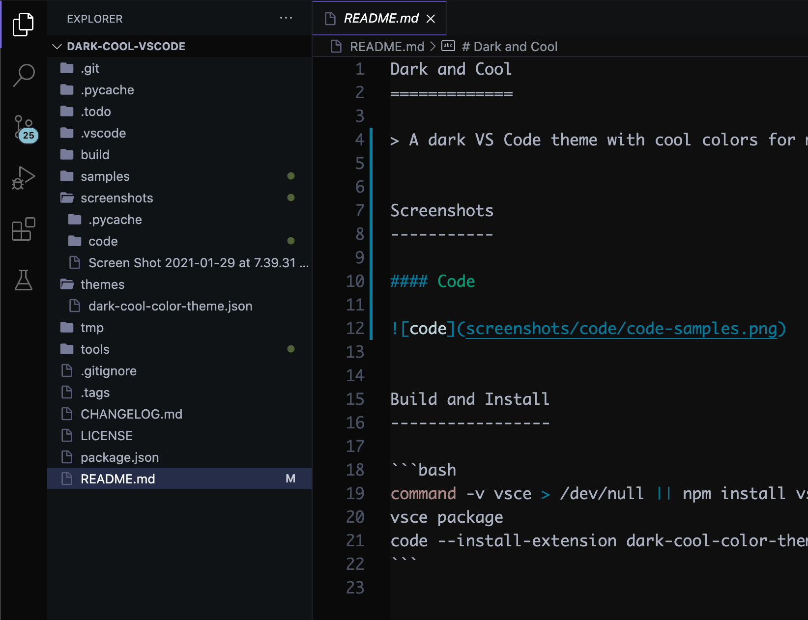
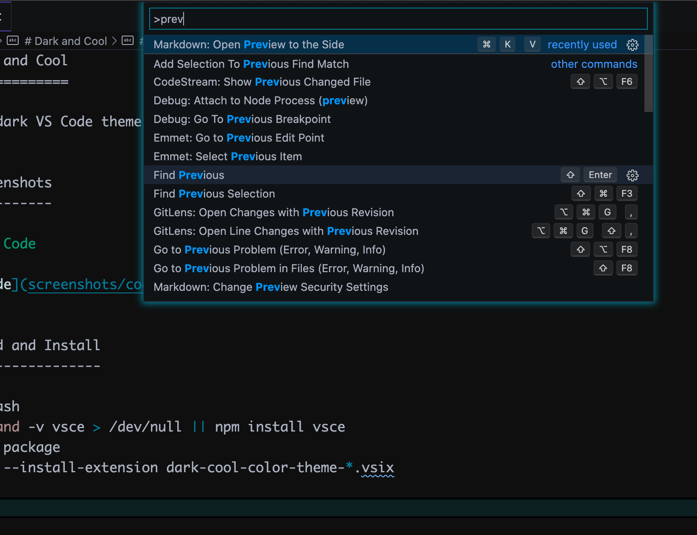
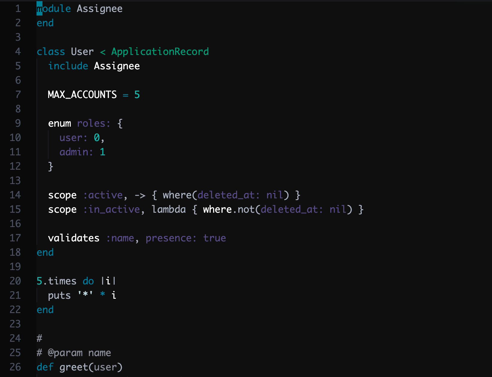
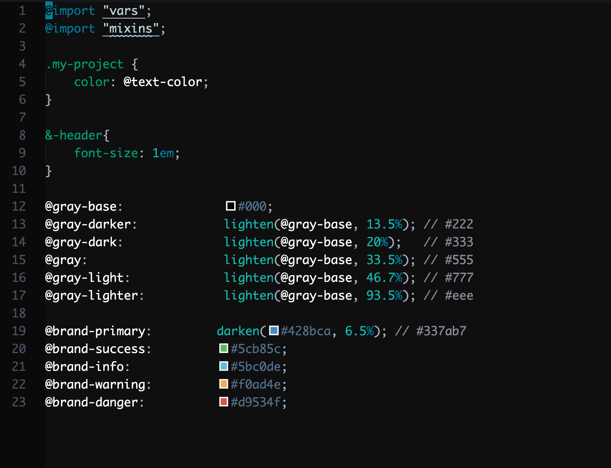

Screenshots
===========

Table of Contents
-----------------

* [Interface](#interface)
	* [Sidebar](#sidebar)
	* [Command Palette](#command-palette)
	* [Inline Diff](#inline-diff)
	* [Debugger](#debugger)
* [Languages](#languages)
	* [Python](#python)
	* [JSON](#json)
	* [Ruby](#ruby)
	* [Markdown](#markdown)
	* [LESS](#less)
	* [React](#react)

Interface
---------

### Sidebar

### Command Palette

### Inline Diff

### Debugger

Languages
---------

### Python

### JSON

### Ruby

### Markdown

### LESS

### React

